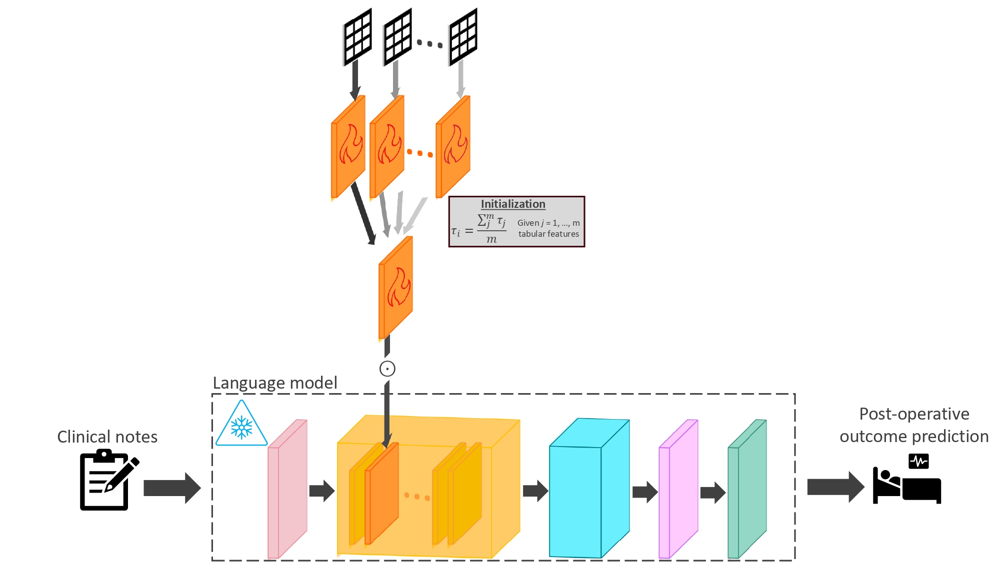

# tipeft

**T**abular-**i**nfused **P**arameter **E**fficient **F**ine**t**uning (tipeft) is a novel PEFT method designed to infuse tabular features into the initialization process of re-parameterization parameter efficient finetuning (PEFT) methods. This provides an element of well-informed and representational capacity towards the newly introduced PEFT parameters, which are usually introduced and initialized independently



It is specifically designed for postoperative predictions in clinical care, where predictive and valuable pre-operative tabular features are often under-utilized in language model finetuning. For now, it supports both `LoRA` and `IA3`


## Requirements  
### Dependencies


The following Python packages are required for `tipeft`:

- `torch`
- `transformers`
- `peft`
- `accelerate`
- `numpy`
- `pandas`
- `scikit-learn`
- `tqdm`

Install dependencies with:

```bash
pip install torch transformers peft accelerate numpy pandas scikit-learn tqdm
```

#### Note on Pytorch installation
Because PyTorch wheels vary by CUDA version and hardware, it is recommended to install PyTorch manually following the instructions at:
https://pytorch.org/ 

### System Requirements

`tipeft` has been tested and verified on the following configuration:

- **OS**: Windows 10
- **Python**: 3.9.19
- **CUDA**: 12.6

#### Important Notes

- **Environment**: Must be run in a Jupyter notebook. Running as a standalone Python script may cause multiprocessing issues.
- **CPU cores**: At least 10 CPU cores recommended (uses `Pool(processes=10)` internally).
- **GPU**: CUDA-compatible GPU required.
- **OS**: Tested on Windows. Linux/Mac compatibility not yet verified.

#### Known Compatibility Limitations

1. **Jupyter only** - Uses `tqdm.notebook` which may not display correctly outside Jupyter.
2. **Multiprocessing** - May behave differently on Linux/Mac due to different multiprocessing backends.

If you encounter issues on a different setup, please open an issue with your system info.

#### GPU requirements

`tipeft` is designed for GPU acceleration.
- At least 1 GPU is recommended
- Suggested minimum: 16GB VRAM 
- Memory usage depends on:
    - sequence length
    - model size
    - batch size
    - peft configuration


## Installation
To install in python, simply do the following: 
```bash
pip install tipeft
```


## Usage

### `train_tabular_infused_IA3`


#### Parameters

- **`train`** (*pandas.DataFrame*): Training dataframe containing text, label, and tabular feature columns (required)
- **`val`** (*pandas.DataFrame*): Validation dataframe with same structure as train (required)
- **`pretrained_model_name`** (*str*): Base model to fine-tune. Supports `"emilyalsentzer/Bio_ClinicalBERT"` or `"microsoft/biogpt"` (required)
- **`label_col`** (*str*): Column name of the binary outcome label. Must contain `True`/`False` values. (required)
- **`text_col`** (*str*): Column name containing the clinical text (required)
- **`columns_unique_labels_of_tabular_features`** (dict): Map feature names to unique values. Use `1` for continuous, `>1` for categorical. (required)
- **`lr`** (*float*): Learning rate for final model training (default: `0.001`)
- **`num_epochs`** (*int*): Number of training epochs (default: `5`)
- **`lr_of_tabular_infused_features`** (*float*): Learning rate for tabular pre-training (default: `0.0001`)

#### Returns

- **`model`** (*PeftModel*): The trained IA3 model
- **`tokenizer`** (*AutoTokenizer*): The tokenizer for the model

#### Example use case

```python
from tipeft import train_tabular_infused_IA3

model, tokenizer = train_tabular_infused_IA3(
    train=train_df,
    val=val_df,
    pretrained_model_name="emilyalsentzer/Bio_ClinicalBERT",
    label_col="in_hospital_mortality",
    text_col="clinical_notes",
    columns_unique_labels_of_tabular_features={
        "gender": 2,
        "insurance": 3,
        "marital_status": 4,
        "anchor_age": 1,
        "anchor_year": 1
    },
    lr=0.001,
    num_epochs=5,
    lr_of_tabular_infused_features=0.0001
)
```


#### Notes

- The `label_col` must contain boolean values (`True`/`False`)
- Categorical features should have `>1` unique labels in `columns_unique_labels_of_tabular_features`
- Continuous/numerical features should have `1` as their value in `columns_unique_labels_of_tabular_features`
- Ensure all unique values in categorical columns appear in both train and val sets
- The trained model is saved to `trained_models/IA3_{pretrained_model_name}_{label_col}`


## Questions?

Contact me at [alba@wustl.edu](mailto:alba@wustl.edu)